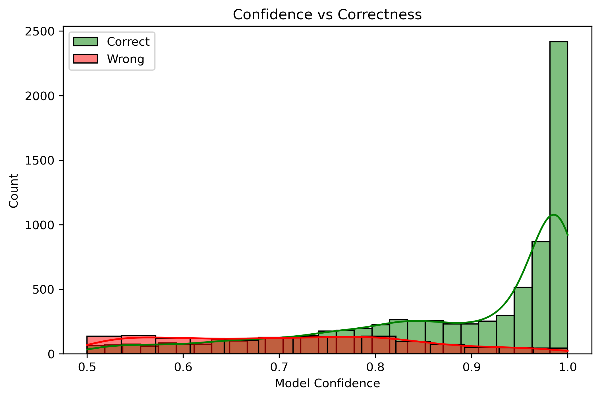
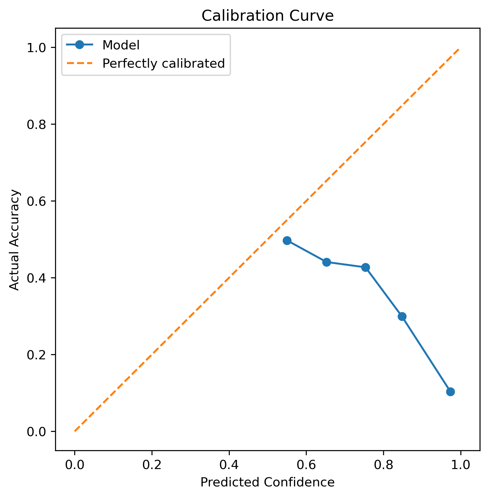
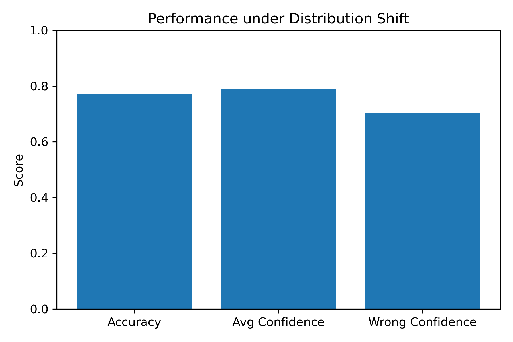
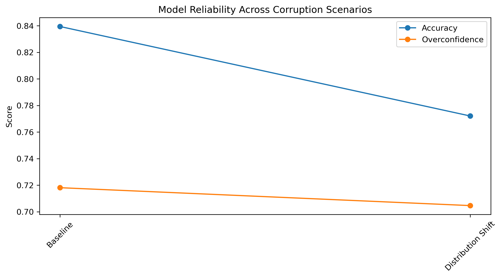

# Confidence vs Correctness: Machine Learning Reliability Study

Independent Machine Learning Research Project

📄 Full Report: [machine_learning_reliability_report.pdf](report/machine_learning_reliability_report.pdf)


## Overview

This project investigates machine learning reliability beyond traditional accuracy metrics. The study evaluates how prediction confidence relates to actual correctness under corruption and distribution shift scenarios.

The project analyzes:
- confidence calibration
- overconfidence behaviour
- robustness under corrupted data
- distribution shift reliability
- comparative model reliability


## Objectives

- Analyze confidence vs correctness distribution
- Evaluate model calibration
- Study reliability under feature noise
- Study reliability under label corruption
- Evaluate robustness under missing data
- Analyze performance under distribution shift
- Compare Logistic Regression and Random Forest models


## Methodology

1. Data preprocessing
2. Baseline model training
3. Confidence extraction
4. Corruption simulation
5. Calibration analysis
6. Distribution shift evaluation
7. Reliability comparison


## Key Findings

- Models can remain highly confident even when incorrect
- Calibration degrades significantly under corruption
- Distribution shift causes major reliability degradation
- Accuracy alone is insufficient for evaluating reliability


## Sample Experimental Outputs

### Confidence vs Correctness Distribution




### Calibration Curve




### Performance under Distribution Shift




### Model Reliability Across Corruption Scenarios




## Repository Structure

```text
Confidence-Reliability-ML/
│
├── confidence_reliability.ipynb
├── data/
├── figures/
├── report/
├── README.md
└── project timeline.md


## Technologies Used

- Python
- Scikit-learn
- NumPy
- Pandas
- Matplotlib
- Jupyter Notebook

---

## Key Learning

Machine learning systems may appear accurate while still being poorly calibrated and unreliable under changing conditions.

Confidence-aware evaluation is essential for trustworthy AI deployment.

---

## Author

Hariharan D
